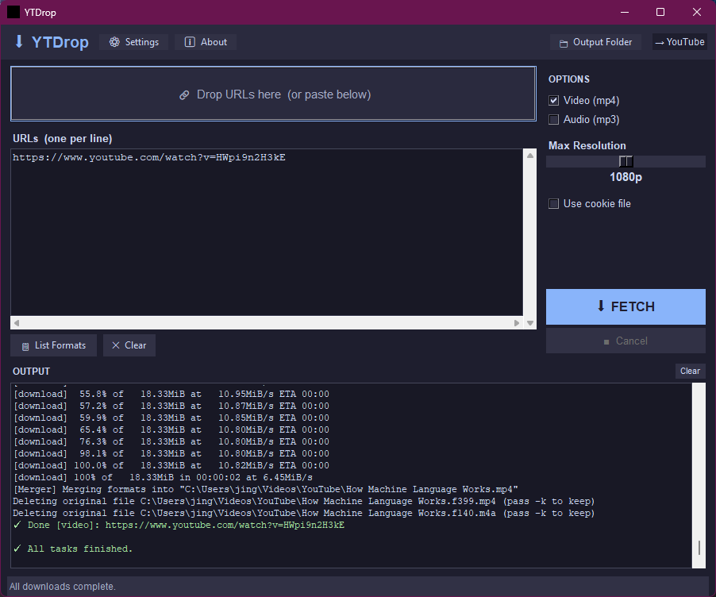

# YTDrop 🎬

**YTDrop** is a cross-platform Python GUI application for [yt-dlp](https://github.com/yt-dlp/yt-dlp) — a powerful command-line tool for downloading videos and audio from YouTube and hundreds of other sites. YTDrop wraps yt-dlp in a clean, themeable desktop interface with drag-and-drop support, a live output console, and per-download log files.



---

## ✨ Features

- 🎨 **15 built-in themes** — dark and light, including Catppuccin, Dracula, Tokyo Night, Nord, and more
- 🖌 **VSCode theme import** — apply any `.json` theme file from the VS Code Marketplace
- 🔗 **Drag-and-drop URL zone** — or paste/type URLs directly
- 📋 **Format browser** — lists all available formats for any URL via `yt-dlp --list-formats`
- 🎞 **Video (mp4) and/or Audio (mp3)** download modes — both can run simultaneously
- 📐 **Resolution slider** — 2160p / 1440p / 1080p *(default)* / 720p / 480p
- 🍪 **Cookie file support** — for age-restricted or members-only content
- ⚙️ **Editable default parameters** for both video and audio modes
- 📁 **Configurable output folder** — defaults to `~/Downloads`
- 📄 **Per-download log files** — saved alongside your media, named to match the output file
- 📺 **Live output console** — colour-coded progress, warnings, and errors
- ❌ **Instant cancel** — stops mid-download or mid-retry immediately

---

## 📋 Requirements

| Requirement | Version | Notes |
|-------------|---------|-------|
| Python | 3.8+ | |
| tkinter | bundled | Included with Python on Windows; may need separate install on Linux/macOS |
| yt-dlp | latest | |
| ffmpeg | any recent | Required for audio extraction and video+audio merging |
| tkinterdnd2 | any | *Optional* — enables native drag-and-drop |

---

## 🚀 Installation

### 1. Install Python

Download from [python.org](https://www.python.org/downloads/) — tkinter is included on Windows and most Linux distributions.

**macOS:** The system Python lacks tkinter. Install via Homebrew:
```bash
brew install python python-tk
```

**Linux:**
```bash
# Ubuntu / Debian
sudo apt install python3 python3-tk

# Fedora
sudo dnf install python3 python3-tkinter

# Arch
sudo pacman -S python tk
```

### 2. Install yt-dlp

```bash
pip install yt-dlp
```

Or download the standalone binary from [yt-dlp releases](https://github.com/yt-dlp/yt-dlp/releases).

### 3. Install ffmpeg

| Platform | Command |
|----------|---------|
| macOS | `brew install ffmpeg` |
| Ubuntu/Debian | `sudo apt install ffmpeg` |
| Fedora | `sudo dnf install ffmpeg` |
| Windows | Download from [ffmpeg.org](https://ffmpeg.org/download.html) and add to PATH |

### 4. Install YTDrop

```bash
# Clone or download this repository
git clone https://github.com/yourname/ytdrop.git
cd ytdrop

# Optional: native drag-and-drop support
pip install tkinterdnd2

# Run
python ytdrop.py
```

### 5. Make launcher scripts executable (macOS / Linux)

```bash
chmod +x launch.sh launch_mac.sh
```

---

## 🖥 Usage

### Launching

| Platform | Method |
|----------|--------|
| **Windows** | Double-click `launch.bat` |
| **Linux** | `./launch.sh` |
| **macOS** | `./launch_mac.sh` |
| **Any platform** | `python ytdrop.py` |

Each launcher checks for Python, tkinter, yt-dlp, and ffmpeg, auto-installs yt-dlp if missing, then starts the app detached from the terminal.

### Adding URLs

- **Type or paste** URLs into the text area (one per line)
- **Click the drop zone** to paste from clipboard
- **Drag URLs** from a browser into the drop zone (requires `tkinterdnd2`)

### Downloading

1. Enter one or more URLs in the URL box
2. Choose **Video (mp4)**, **Audio (mp3)**, or **both** using the checkboxes
3. Set the maximum resolution with the slider (video only)
4. Check **Use cookie file** if needed
5. Click **⬇ FETCH**

Each download produces a matching log file in the output folder (e.g. `My Video Title.video.log`).

### Listing Formats

Click **📋 List Formats** to run `yt-dlp --list-formats` on every URL in the list. Results appear in the Output window showing all available quality levels and format codes.

### Cancelling

Click **■ Cancel** at any time to stop immediately. The cancel is effective between every output line — it won't wait for a full retry loop (such as ten `HTTP 404` fragment retries) to complete before stopping.

### Settings

Open **⚙ Settings** to configure:

**Appearance** — choose from 15 built-in themes or import a VSCode theme (see [Themes](#-themes) below).

**Cookie file** — path to a `cookies.txt` file for authenticated downloads.

**Default parameters** — the yt-dlp flags used for each mode. These are editable text fields so you can add any yt-dlp option.

Default video parameters:
```
-f 'bestvideo[ext=mp4][height<={res}]+bestaudio[ext=m4a]/best[ext=mp4][height<={res}]/best' -o "%(title)s.%(ext)s"
```

Default audio parameters:
```
--extract-audio --audio-format mp3 --audio-quality 0 -o "%(title)s.%(ext)s"
```

`{res}` is automatically substituted with the value from the resolution slider.

### Output Folder

Click **📁 Output Folder** in the toolbar to choose where files are saved. The current folder name is shown next to the button. Defaults to `~/Downloads`.

---

## 🎨 Themes

### Built-in themes

YTDrop ships with 15 themes in dark and light variants:

**Dark**

| Theme | Style |
|-------|-------|
| Catppuccin Mocha *(default)* | Soft purple-blue pastels |
| One Dark Pro | Atom-inspired cool greys and blues |
| Tokyo Night | Deep navy with violet accents |
| Dracula | Classic purple and pink |
| Nord | Arctic blue-greys |
| GitHub Dark | GitHub's official dark UI |
| Gruvbox Dark | Warm retro browns and oranges |
| Monokai | High-contrast neons on near-black |
| Solarized Dark | Precision-designed low-contrast dark |
| Material Dark | Google Material deep grey |

**Light**

| Theme | Style |
|-------|-------|
| Catppuccin Latte | Warm cream and lavender |
| GitHub Light | GitHub's official light UI |
| Solarized Light | Precision-designed low-contrast light |
| Gruvbox Light | Warm parchment and earth tones |
| One Light | Atom-inspired warm off-white |

Click any theme row in Settings to preview and apply it instantly. The dialog re-skins itself live, including live colour swatches on every row.

### Importing VSCode themes

Any VS Code `.json` or `.jsonc` theme file can be imported:

1. Open **⚙ Settings**
2. Click **⬆ Import VSCode Theme (.json)…**
3. Select the theme file

The importer handles:
- Standard JSON
- JSONC with `//` line comments and `/* */` block comments
- Trailing commas
- `$schema` fields containing `vscode://` URIs (which a naïve comment stripper would break)

Imported themes appear in the list marked with **✦** and can be removed with the **✕** button. They are saved in `~/.ytdrop_config.json` and persist between sessions.

#### Where to get VSCode theme files

**From GitHub** — most themes are open source. Find a theme on the [VS Code Marketplace](https://marketplace.visualstudio.com/search?target=VSCode&category=Themes), follow the repository link, navigate into the `themes/` folder, and save the `.json` file.

| Theme | Repository |
|-------|-----------|
| One Dark Pro | [github.com/Binaryify/OneDark-Pro](https://github.com/Binaryify/OneDark-Pro/tree/master/themes) |
| Dracula | [github.com/dracula/visual-studio-code](https://github.com/dracula/visual-studio-code/tree/master/theme) |
| Tokyo Night | [github.com/enkia/tokyo-night-vscode-theme](https://github.com/enkia/tokyo-night-vscode-theme/tree/master/themes) |
| Catppuccin | [github.com/catppuccin/vscode](https://github.com/catppuccin/vscode/tree/main/packages/catppuccin-vsc/themes) |
| Nord | [github.com/nordtheme/visual-studio-code](https://github.com/nordtheme/visual-studio-code/tree/develop/themes) |
| Night Owl | [github.com/sdras/night-owl-vscode-theme](https://github.com/sdras/night-owl-vscode-theme/tree/master/themes) |
| Ayu | [github.com/ayu-theme/vscode-ayu](https://github.com/ayu-theme/vscode-ayu/tree/master/ayu-themes) |
| Material Theme | [github.com/material-theme/vsc-material-theme](https://github.com/material-theme/vsc-material-theme/tree/main/themes) |
| Monokai Pro | [github.com/Monokai/monokai-pro-vscode](https://github.com/Monokai/monokai-pro-vscode/tree/master/themes) |

**From your VS Code installation** — if you already have VS Code installed, every theme is already on disk:

| Platform | Path |
|----------|------|
| macOS / Linux | `~/.vscode/extensions/<theme-name>/themes/*.json` |
| Windows | `%USERPROFILE%\.vscode\extensions\<theme-name>\themes\*.json` |

---

## 📄 Log Files

Every fetch and list-formats operation produces a `.log` file in the output folder. The filename mirrors the downloaded media file:

```
My Awesome Video.video.log
My Awesome Video.audio.log
https___www.youtube.com_watch_v=....list-formats.log
```

Each log contains the full command that was run and the complete yt-dlp output, useful for diagnosing failures after the fact.

---

## 🍪 Cookie Files

Some content requires authentication — age-restricted videos, channel memberships, or region-locked uploads. Export cookies from your browser and supply them to YTDrop:

1. Install a browser extension such as **"Get cookies.txt LOCALLY"** (Chrome/Edge) or **"cookies.txt"** (Firefox)
2. Visit the site (e.g. youtube.com) while logged in
3. Export cookies as `cookies.txt`
4. In YTDrop → **Settings** → **Cookie File** → **Browse…** and select the file
5. Check **"Use cookie file"** in the Options panel before fetching

---

## 📁 File Structure

```
ytdrop/
├── ytdrop.py              # Main application (single file, no extra GUI dependencies)
├── launch.bat             # Windows launcher — checks deps, runs pythonw (no console window)
├── launch.sh              # Linux launcher  — checks deps, detaches from terminal
├── launch_mac.sh          # macOS launcher  — prefers pythonw / Homebrew Python
├── requirements.txt       # pip dependencies
└── README.md              # This file

# Created automatically at runtime:
~/.ytdrop_config.json        # Saved preferences
<output_folder>/<title>.log  # Per-download log files
```

`~/.ytdrop_config.json` stores:

| Key | Description |
|-----|-------------|
| `theme_name` | Active theme name |
| `theme_custom` | Imported VSCode themes (stored as colour dicts) |
| `cookie_file` | Path to cookies.txt |
| `video_params` | yt-dlp flags for video downloads |
| `audio_params` | yt-dlp flags for audio downloads |
| `download_dir` | Output folder path |

Old config files using the legacy `"theme": "dark"` / `"theme": "light"` format are automatically migrated on first launch.

---

## 🛠 Troubleshooting

| Problem | Solution |
|---------|----------|
| `yt-dlp not found` | Run `pip install yt-dlp` or ensure the binary is on your PATH |
| No audio track in downloaded video | Install ffmpeg |
| Download fails immediately | Click **List Formats** first — the URL may be geo-blocked or require login |
| Age-restricted content fails | Set up and enable a cookie file |
| Drag-and-drop not working | Run `pip install tkinterdnd2` |
| Theme import fails | Ensure the file is a VS Code colour theme JSON, not a settings or keybindings file |
| Files saved to wrong folder | Check the **Output Folder** button in the toolbar shows the expected path |
| Swatches disappear after switching theme | Update to the latest `ytdrop.py` — this was a known bug, now fixed |

---

## 📄 License

Apache 2 License — free to use, modify, and distribute.

---

## 🙏 Credits

- [yt-dlp](https://github.com/yt-dlp/yt-dlp) — the engine powering all downloads
- [Python tkinter](https://docs.python.org/3/library/tkinter.html) — GUI framework
- Built-in colour palettes from [Catppuccin](https://github.com/catppuccin/catppuccin), [Dracula](https://draculatheme.com), [Nord](https://www.nordtheme.com), [Tokyo Night](https://github.com/enkia/tokyo-night-vscode-theme), and others
